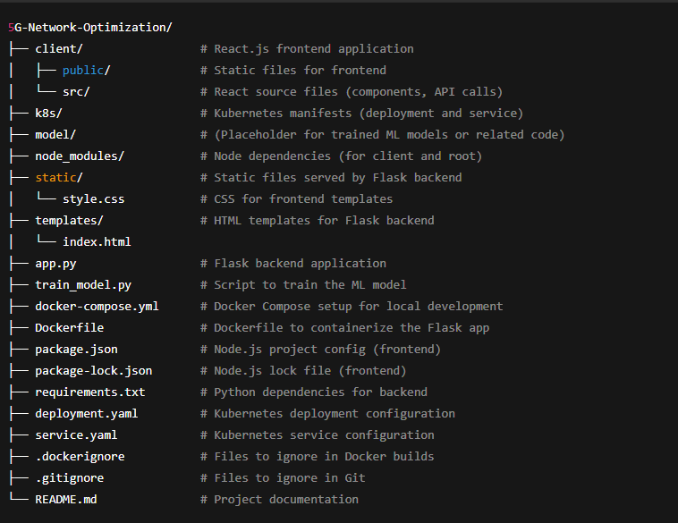

5G Network Optimization Project

# 🎥 Project Walkthrough

We have prepared a video walkthrough explaining the project development, approach, and key results.

👉 [Watch the Project Walkthrough Video Here](https://drive.google.com/file/d/1h3nmruRApIChg2XC1s91aYcFLJdgwEPu/view?usp=sharing)

This project aims to optimize 5G network parameters using machine learning models.
It includes a frontend (React.js), backend (Flask), ML model training, and Kubernetes deployment setup.

# 📁 Project Structure

Here is the overall file structure of the project:

Getting Started
1. Clone the Repository
git clone https://github.com/sapnamehar6264/2024GR31CS462.git
cd 5G-Network-Optimization

🛠️ Installation

Backend (Flask API)
# Navigate to project root
pip install -r requirements.txt
# Run the Flask app
python app.py

Frontend (React App)
cd client
npm install
npm start

🐳 Running with Docker
# Build and run containers
docker-compose up --build

☁️ Kubernetes Deployment
Make sure you have Kubernetes and kubectl configured.
kubectl apply -f k8s/deployment.yaml
kubectl apply -f k8s/service.yaml

📊 Machine Learning Model
train_model.py contains the code to train the optimization model.

📦 Dependencies
Frontend: React
Backend: Flask, sklearn, numpy, pandas
Containerization: Docker, Docker Compose
Deployment: Kubernetes

✍️ Author
Rajan Patel (202251093)
Sapna Mehar (202252336)
Tanishka Sharma (202251140)
Pari Ranasaria (202251084)
